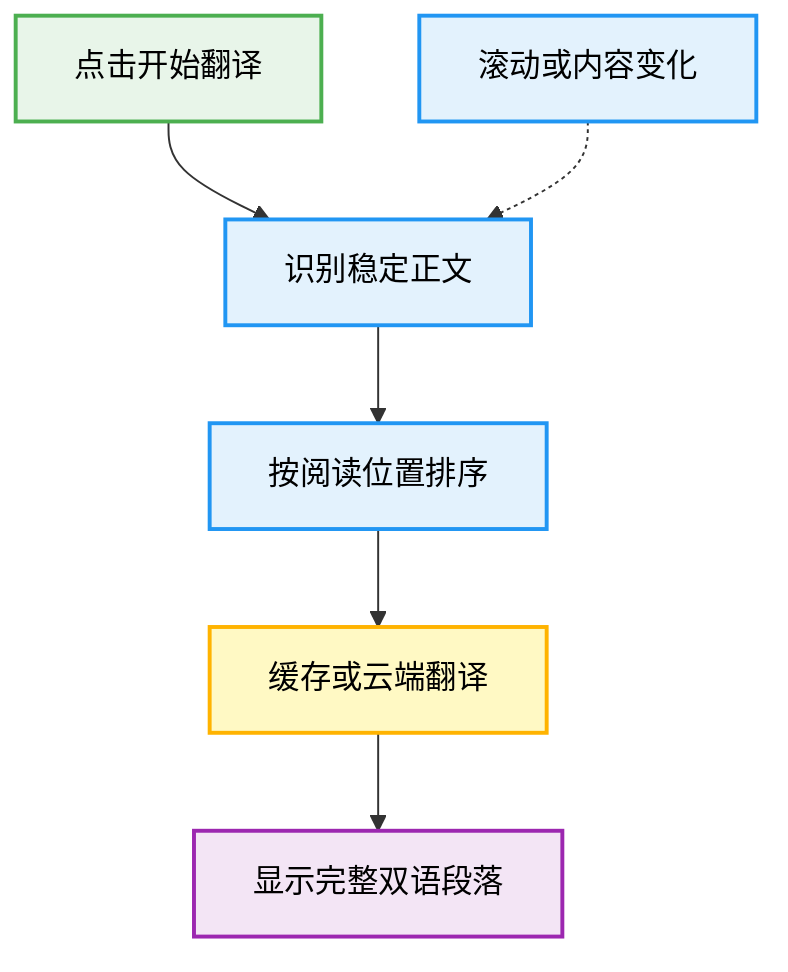

# 一键双语翻译

保留原文的中英网页翻译扩展。优先翻译正在阅读的段落，随滚动补齐正文，随时恢复页面。

## 使用

需要 **Chrome 140+** 和翻译服务的 **API Key**。默认使用 DeepSeek，其他服务在设置中选择。

1. 下载仓库，在 `chrome://extensions` 开启开发者模式，加载 `chrome-extension/`。
2. 在设置页选择服务、填写 Key，点击「保存并测试」。
3. 打开网页，在扩展面板点击「翻译」；再次点击「恢复」撤下译文。

仓库已含构建产物，无需安装 Node.js。更新后重新加载扩展并刷新网页。

## 流程



滚动时补查待恢复正文，内容变化时局部重扫；每波请求按当前视口排序，长段落收齐全部分片后再展示。

## 边界

- 正文会发送给所选服务，可能产生费用；Key 保存在本机，网页内容脚本不能读取。
- 翻译稳定正文，跳过持续变化的轮播和动画文本；代码块默认跳过，直接打开的纯文本或 Markdown 文档除外。
- 不支持浏览器受限页面、PDF、Shadow DOM、iframe、图片和输入框。

## 开发

Node.js 24，具体版本见 [`.nvmrc`](.nvmrc)。

```bash
npm ci --ignore-scripts
npm run build:chrome
npm run check
```

修改源码后构建并重新加载扩展；生成文件不要手改。

[开发说明](docs/README.md) · [测试过的网站](docs/tested-websites.md) · [设计规范](DESIGN.md)
