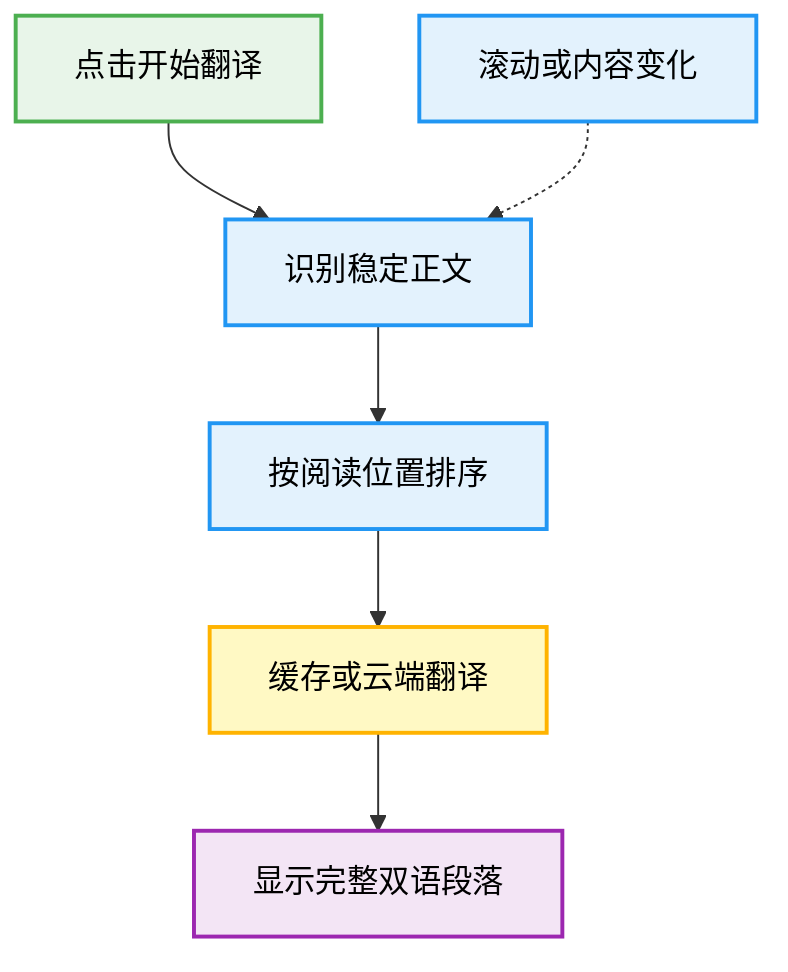

# 一键双语翻译

保留原文的中英网页阅读扩展。逐段显示双语，随滚动和内容更新补齐正文；也可以选中一句翻译、复制译文，或听英语发音。

## 使用

需要 **Chrome 140+** 和翻译服务的 **API Key**。默认使用 DeepSeek，其他服务在设置中选择。

1. 下载仓库，在 `chrome://extensions` 开启开发者模式，加载 `chrome-extension/`。
2. 在设置页选择服务、填写 Key，点击「保存并测试」。
3. 打开网页，在扩展面板点击「翻译」；再次点击「恢复」撤下译文。

弹窗会显示当前页面的真实状态，可以选择柔和底色、自然段落或细线标记。字号、行距、默认划词开关和发音设置位于「设置 → 阅读与英语发音」，保存后会更新已开启页面的译文样式。

## 划词与朗读

- 整页翻译会按阅读偏好启用划词；也可以在弹窗单独点击「启用划词」。选中文字后点击快捷按钮，查看原文与译文、复制译文或朗读英语。
- 任意网页可通过右键菜单「双语翻译选中文字」进入；右键「朗读选中的英语」可直接发音。
- `Alt+Shift+D` 翻译或恢复整页，`Alt+Shift+S` 翻译选中文字；macOS 使用 `Control+Shift+D/S`。快捷键可在 `chrome://extensions/shortcuts` 修改。
- 默认使用系统已安装的英语语音。**Edge TTS** 可选择美式 Aria/Guy 或英式 Sonia/Ryan；需要启动随仓库提供的[本地语音服务](tools/edge-tts/README.md)，填写地址与令牌并授权访问。扩展不自动安装或启动该服务。

划词只在点击翻译时提交所选文字，最长 12,000 个字符；每次朗读最多 6,000 个字符。关闭浮层或更换选区会取消旧翻译、停止旧语音；错误可直接重试。

仓库已含构建产物，无需安装 Node.js。更新后重新加载扩展并刷新网页。

## 流程


```mermaid
flowchart TB
    Start[点击开始翻译]:::user --> Content[识别稳定正文]:::state
    Change[滚动或内容变化]:::state -.-> Content
    Content --> Queue[按阅读位置排序]:::state
    Queue --> Translate[缓存或云端翻译]:::api
    Translate --> Result[显示完整双语段落]:::display

    classDef user fill:#E8F5E9,stroke:#4CAF50,stroke-width:2px,color:#000000
    classDef state fill:#E3F2FD,stroke:#2196F3,stroke-width:2px,color:#000000
    classDef api fill:#FFF9C4,stroke:#FFB300,stroke-width:2px,color:#000000
    classDef display fill:#F3E5F5,stroke:#9C27B0,stroke-width:2px,color:#000000
```

滚动时补查待恢复正文，内容变化时局部重扫；每波请求按当前视口排序，长段落收齐全部分片后再展示。

## 边界

- 正文会发送给所选服务，可能产生费用；Key 保存在本机，网页内容脚本不能读取。
- 翻译稳定正文，跳过持续变化的轮播和动画文本；代码块默认跳过，直接打开的纯文本或 Markdown 文档除外。
- 通用扫描覆盖标题、段落、列表、表格、引用、混合内联文本、直接打开的纯文本/Markdown 和开放的 Shadow DOM；动态内容与展开后的正文会增量处理。保留原有链接、代码、数学公式及编辑区。
- 主框架与可访问的 iframe 分别运行；跨域 HTTPS 框架可在阅读设置中额外授权。未授权、沙盒限制或浏览器禁止注入的框架会跳过，不阻断主页面。
- 浏览器受限页面、PDF、图片中的文字、输入框和闭合 Shadow DOM 不属于 DOM 翻译范围。不同网站的特殊布局仍可能需要独立适配；代码覆盖不等于当前实站已经验收。
- 本次 0.5.0 改动按要求仅修改和审阅代码，未运行测试、浏览器验证或真实翻译/语音请求。

## 开发

Node.js 24，具体版本见 [`.nvmrc`](.nvmrc)。

```bash
npm ci --ignore-scripts
npm run build:chrome
npm run check
```

修改源码后构建并重新加载扩展；生成文件不要手改。

[开发说明](docs/README.md) · [历史网站适配记录](docs/tested-websites.md) · [设计规范](DESIGN.md)
