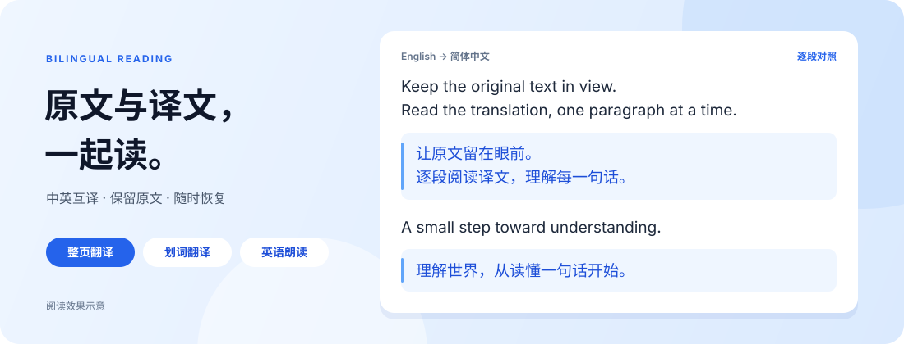

<div align="center">


<h1>一键双语翻译</h1>

<p><strong>保留原文，读懂另一种语言。</strong></p>

<p>一个专注于中英网页阅读的 Chrome 扩展。<br />整页对照、划词翻译与英语朗读，在当前网页完成。</p>

<p><code>Chrome 140+</code> &nbsp; <code>Manifest V3</code> &nbsp; <code>中英互译</code></p>

<p>
  <a href="#开始使用">开始使用</a> ·
  <a href="#支持的服务">支持的服务</a> ·
  <a href="#操作与快捷键">快捷键</a> ·
  <a href="docs/README.md">开发说明</a>
</p>

</div>

<p align="center">
  
</p>

## 能做什么

| 功能 | 阅读体验 |
| --- | --- |
| **📖 双语阅读** | 保留原文，正文逐段对照；短按钮和导航标签显示行内译文。支持中英互译与输入语言自动检测。 |
| **✏️ 划词翻译** | 在面板启用划词，选中文字后点击「翻译」。长原文默认折叠，支持复制译文、重试和 `Esc` 关闭。 |
| **🔄 增量翻译** | 开启后自动跟随滚动和页面新增内容，适合持续加载的网页。 |
| **🔊 英语朗读** | 直接朗读英语选区，或朗读中文选区的英语译文。默认使用系统声音，也可配置 Edge TTS。 |
| **阅读偏好** | 调整译文样式、字号、行距与声音，让双语内容更适合自己的阅读习惯。 |
| **用量与缓存** | 在设置中查看本月用量；命中缓存的译文不会再次请求 API。 |

翻译时，页面角落显示加载动画和进度，完成后显示绿色勾号。请求失败会保留已有译文，点击「重试」即可继续。

## 开始使用

**准备好 Chrome 140+ 和所选翻译服务的 API Key，即可开始。**

### 1. 加载扩展

1. 下载并解压本仓库，或使用 Git 克隆到本地。
2. 打开 `chrome://extensions`，开启右上角的「开发者模式」。
3. 点击「加载已解压的扩展程序」，选择仓库中的 **`chrome-extension/`** 目录。

> 仓库已包含可直接加载的构建产物，首次使用无需安装 Node.js 或执行构建。

### 2. 连接翻译服务

打开扩展的设置页，选择服务并填写 API Key，然后点击 **「保存并测试」**。默认使用 **DeepSeek**，也可切换为下方列出的其他服务。

### 3. 开始双语阅读

打开网页，点击扩展面板中的 **「翻译网页」**。译文会逐段与原文对照显示；点击 **「恢复原文」** 即可撤下译文。需要另一种翻译方向时，在面板中调整输入与输出语言。

> **更新后**：在扩展管理页重新加载扩展，并刷新网页。如果修改了源码，先按[开发说明](docs/README.md)重新构建。

## 支持的服务

使用自己的 API Key，在设置页选择服务与模型。

| 类型 | 服务 | 配置方式 |
| --- | --- | --- |
| 默认服务 | **DeepSeek** | 填写 API Key，选择模型。 |
| 其他模型服务 | OpenAI · Gemini · Anthropic | 填写对应服务的 API Key，选择模型。 |
| 机器翻译 | DeepL · Azure Translator | DeepL 自动识别 Free / Pro 密钥；Azure 区域与资源配置保持一致，全局资源可留空。 |
| 自定义服务 | OpenAI Chat Completions 兼容接口 | 填写服务地址、模型与 API Key，支持兼容的代理或私有部署。 |

## 操作与快捷键

| 操作 | Windows / Linux | macOS |
| --- | --- | --- |
| 打开翻译面板 | `Alt` + `Shift` + `B` | `Control` + `Shift` + `B` |
| 翻译 / 恢复整页 | `Alt` + `Shift` + `D` | `Control` + `Shift` + `D` |
| 翻译选中文字 | `Alt` + `Shift` + `S` | `Control` + `Shift` + `S` |

- **右键菜单**：选中文字后，可直接翻译或朗读选区。
- **阅读与发音**：通过面板底部入口调整阅读偏好。自动划词设置只决定下次开启整页翻译时的默认行为。
- **自然语音**：需要 Edge TTS 时，按[本地语音服务说明](tools/edge-tts/README.md)配置。
- **快捷键调整**：可在 `chrome://extensions/shortcuts` 中修改默认组合键。

## 使用范围与隐私

- **数据与费用**：网页文字会发送给你选择的翻译服务，可能产生费用。API Key 和语音令牌仅保存在本机的扩展存储中。
- **嵌入内容**：支持可访问的 iframe 和开放 Shadow DOM。跨域嵌入内容可能需要在设置中的「嵌入网页」区域授权访问。
- **内容限制**：浏览器受限页面、PDF、图片文字和闭合 Shadow DOM 无法通过普通网页 DOM 翻译；代码块和编辑区默认跳过。
- **长度与取消**：划词最多 **12,000 字符**，英语朗读最多 **6,000 字符**。关闭浮层或更换选区会取消对应请求和朗读。

## 本地开发

<details>
<summary><strong>展开构建步骤</strong></summary>

使用 **Node.js 24** 与 **npm**，在仓库根目录执行：

```sh
npm ci --ignore-scripts
npm run build:chrome
```

构建后加载 `chrome-extension/`。源码修改后，重新构建、重新加载扩展，再刷新网页。

源码入口、图标维护与验证约束见[开发说明](docs/README.md)。

</details>
