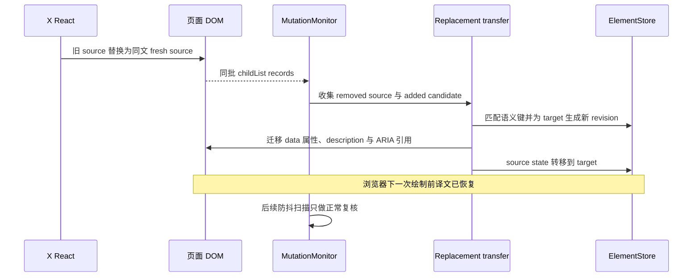

# X hover 跳动与双语呈现故障复盘

本文记录 2026-08-09 对 X/Twitter 双语翻译跳动问题的完整排查与修复过程。它既解释最终根因，也保留那些“看起来已经修好、实际仍不完整”的中间方案，供以后修改 SPA、虚拟列表和站点专属呈现时复用。

这里的 fresh replacement 指“宿主用文本与语义相同、JavaScript 身份却不同的新 `Element` 替换旧元素”。2026-08-09 版本的 `generated` 呈现由原文元素的 data 属性和 `::after` 承载可见译文；2026-08-27 起，`generated` 保留同一套稳定迁移状态机，但可见载体改为末段原文 carrier 内的 owned `<span>` 和真实 `Text` 节点。本文把译文节点、镜像属性和内存状态统称为 surface；ARIA 引用只属于旧版历史与兼容清理。

“排查过程”和“2026-08-09 用户环境验收”是历史记录，不随以后实现改写；“回归保护”和“当前设计边界”描述当前维护契约，相关源码变化时必须同步更新。

| 项目 | 结论 |
| --- | --- |
| 用户可见症状 | 鼠标移入 X 帖子或右侧趋势卡片时，译文短暂消失再出现，帖子高度和列表位置随之跳动 |
| 最终根因 | X 的 React 更新会把已翻译正文替换为同文的 fresh `Element`；旧实现把状态绑定在旧元素身份上，只能等待防抖重扫恢复 |
| 2026-08-09 策略 | X 使用不进入宿主 child tree 的 generated presentation，并在同一 MutationObserver 批次内把状态原子迁移到语义等价的新元素 |
| 2026-08-27 策略 | X 使用 source 内唯一、自然可访问的真实译文 child；宿主破坏时按运行时身份规范化，fresh replacement 时原子迁移同一节点 |
| 深度思考场景 | 深度思考不是 DOM 跳动的直接原因；X 替换内层 carrier 造成译文脱落，而长请求波次把等待重扫的空白时间放大 |
| 自动验证 | 2026-08-09 为 204/204；2026-08-27 真实 DOM 基础修复为 290/290；后续 carrier/loading 修复按用户要求只重建 runtime，未运行测试或浏览器验证 |
| 用户验收 | 用户在真实 X 页面复测帖子和右栏 hover 后确认通过 |

## 2026-08-27 后续修复：译文必须是真实可选择文本

用户发现 `::after { content: attr(data-bt-translation) }` 显示的中文无法在真实 Chrome 中用鼠标选择。此前自动化只检查 CSS 中存在 `user-select: text`，并没有证明浏览器 Selection 能锚定伪元素内容；用户实测直接证伪了这个假设。

当前实现保留 generated presentation 的 replacement transfer、revision、运行级 registry、可见性宽限和停止清理，只替换可见载体：

```html
<div data-testid="tweetText" data-bt-presentation="generated">
  <span>
    Original post
    <span class="bt-translation bt-translation-generated" data-bt-owned="true">
      <br><span class="bt-translation-inner" lang="zh-CN">真实中文译文</span>
    </span>
  </span>
</div>
```

新的核心不变量是：

- `state.translationNode` 指向用户实际看到的 `<span>`，其首个 child 是普通 `Text`；
- 译文不设 `aria-hidden`，通过自身 `lang` 作为自然正文进入可访问 DOM；source 原有的 `aria-describedby` 从创建到停止均保持不变；
- 宿主原有 children 的 identity 和顺序不变，译文是末段原文 carrier 内唯一的 generated child；
- 宿主单独删除译文时，MutationObserver callback 内复挂同一个 Element 和 Text，不失效、不重翻译；
- 宿主改写译文的 class、owned/run marker、ID、语言、`translate` 或 Text 时，以运行时 WeakMap 身份和初始内容为权威同步恢复；
- fresh source replacement 允许译文随旧 source 暂时 disconnected，并把同一节点迁移到新 source；
- `cloneNode(true)` 带来的 cloned 译文先被去重，target 最终只保留 store 跟踪的 canonical 节点；
- cloned 译文即使被包进 wrapper，也按稳定节点 ID 删除；不同 ID 的合法嵌套 source 译文不受影响；
- scanner、replacement 文本比较和 volatility 统计都显式排除 owned descendants；
- 停止运行通过 store 中的真实节点引用清理 detached source，避免旧帖子重挂后复活译文。

自动回归现在把 Range 的 start/end 与 Selection 的 anchor/focus 都锚定到译文 `Text` 节点，并断言 `selection.toString()` 返回完整中文；这不再只是 CSS 字符串契约。仓库规则仍禁止未授权的浏览器自动化，因此真实鼠标拖选需要用户重新加载扩展后在 X 中复验。

### 内层 carrier replacement 与深度思考放大

真实译文进入 DOM 后出现了一个不同于 fresh source replacement 的缺口：X 可以只替换末段原文的内层 carrier，外层 source 仍保持 connected。整 source 迁移不会触发，canonical 译文却随旧 carrier 一起被移除。旧恢复路径继续使用 WeakMap 中已 disconnected 的 anchor，失败后使 source 失效，只能等待 180ms 防抖重扫；若此时深度思考模型的并发请求波次尚未全部结束，根队列还要等 `Promise.allSettled`，可见缺口就被放大到整段请求时长。

当前恢复顺序改为异常优先：MutationObserver 收到 removed subtree 后，先按 ElementStore 身份找到 canonical 译文，再从仍连接的 source 计算当前 candidate。只有新旧原文哈希一致时，才在同一 callback 把同一个译文 Element/Text 复挂到新的 `presentationAnchor`；candidate 缺失、原文变化或复挂失败时才失效并重扫。深度思考仍可能很慢，但不再承担已完成译文的 DOM 恢复职责。

当前行 loading 与译文节点采用不同边界：`state.loading.requests` 保存覆盖该正文的在途批次 token，`data-bt-loading` 只是派生呈现。CSS 用绝对定位的 `::after` 在文字右侧画 spinner，不插入 React child tree，也不参与换行或帖子高度；并发批次只有最后一个 token 结束时才移除标记，停止和失效路径会立即清理。若 carrier replacement 发生在请求途中，只在 X/generated、source 仍连接、queued revision 确有 token 且当前哈希不变时保留原请求和 loading；响应渲染会重新读取新 anchor，不继承旧 carrier 身份。

## 影响范围

最初报告来自 X 帖子 hover，随后确认同一类问题也出现在右侧趋势、推荐和 Explore 主内容。页面上可见的是两个状态反复切换：

```text
原文 + 译文
   ↓ hover / React reconcile
只有原文
   ↓ 防抖扫描 + 运行缓存回填
原文 + 译文
```

翻译请求数通常没有增加，因为运行缓存仍然命中。问题不在 Provider、网络或翻译结果，而在译文呈现与宿主 DOM 生命周期没有一起迁移。

本轮还处理了两个相邻的页面边界问题：

- X 不能为了稳定帖子而只允许 `[data-testid="tweetText"]`，否则 Explore 和右栏非推文正文会完全不翻译。
- Hacker News 标题译文应另起一行，但译文后的来源站点 `(github.com/…)` 必须继续在同一行展示。

## 为什么这个问题难以一次定位

### 1. hover 本身不是根因

扩展没有注册 hover 监听器。hover 只是触发 X 自己的 React 更新、class/style 变化、控件挂载或 fresh 节点替换。真正需要观察的是 hover 之后的 DOM mutation，而不是鼠标事件本身。

### 2. 缓存正常仍然会跳

旧节点失效后，运行缓存可以避免第二次网络请求，但新节点仍要等扫描器重新发现、规划器重新建 record、渲染器重新写入呈现。这个等待窗口足以让译文消失一个或多个可见帧。

### 3. 最初的 hover 测试没有模拟 X 的真实动作

早期回归只做了以下操作：

- 派发 inert `pointerover` / `pointerout`；
- 修改已有节点的 class/style；
- 移除后重新挂回同一个 `Element`；
- 用 `data-bt-translation` 是否存在来模拟高度。

这些测试证明“同一个节点还活着时”呈现稳定，却没有让宿主创建 fresh `Element`。因此测试可以全绿，真实 X 仍然跳动。

## 排查过程

### 阶段一：从 TODO 确认设计边界

首先审阅了 [`todo.md`](../todo.md)，确认这次问题与其中两条原则直接相关：

- 内容语义和安全插入边界必须分开。一个节点是正文，不代表可以向它的宿主子树插入真实 DOM。
- 站点规则必须按精确 hostname 收口，动态扫描与初次扫描必须使用同一套规则。

这一步避免了把 X 专项规则散落到通用过滤器和渲染器中。

### 阶段二：定位真实 DOM 插入与恢复反馈环

通用 flow renderer 会创建 `.bt-translation`，再把它作为 source 的 child 或 sibling 插入页面。X 的 React reconcile 可能把未知节点移除；MutationObserver 看到译文被移除后又会触发恢复。页面高度因此可能在“有译文”和“无译文”之间往复。

这解释了最初的跳动，但还不是最终根因的全部。

### 阶段三：改用 generated presentation

X 的正文改成 generated presentation：

- 可见译文保存在 source 的 `data-bt-translation`；
- CSS 使用 source 的 `::after` 显示译文；
- 一个离屏、扩展拥有的 description 节点保留可访问文本；
- `aria-describedby` 在不覆盖宿主既有引用的前提下关联 description；
- X 的 React child tree 中不再出现扩展新增的译文 child/sibling。

这关闭了“宿主删除未知译文节点”的反馈环，也保证帖子原有 child identity 和顺序不变。

### 阶段四：发现过度收窄导致 X 不翻译

第一版 X 策略曾把所有非 `tweetText` 内容都视为 excluded。结果是帖子可能稳定了，但 Explore、新闻卡片和右栏正文直接失去翻译。这正是“内容语义”和“插入安全”混为一谈的反例。

修正后的 [`site-profile.js`](../src/content/site-profile.js) 采用精确 X hostname，排除导航、菜单、tooltip、用户名、帖子动作组和 Show more 控件；其他通过通用正文筛选的 X 内容仍可翻译，并统一使用 generated presentation。

### 阶段五：补齐 generated 生命周期

generated presentation 引入了新的状态一致性要求。排查中逐项关闭了这些缺口：

- source 或后代发生 `hidden` / `role` 变化时，不再先删译文再重扫；
- class/style 引起的瞬时不可见状态不会清除 generated 译文；source 隐藏时译文自然一起隐藏；
- 宿主删除单个 `data-bt-*` 属性后，从 ElementStore 的已跟踪状态立即恢复；
- description、source 属性和 `aria-describedby` 可以幂等清理；
- 新脚本上下文会清除旧运行遗留；宿主只碰巧使用 `data-bt-translation` 或 `data-bt-description-id`、但没有扩展 ownership marker 时保持不变；
- source 脱离 DOM、MutationObserver 尚未交付时停止运行，仍能通过运行级 registry 清理；
- mutation 与 visibility 的定时器改为真正 debounce，每次新活动都会重置等待窗口。

这些修复让“同一个 source 元素仍存在或稍后重挂”的场景稳定，但用户复测仍发现帖子和右栏 hover 会跳。

### 阶段六：构造 fresh `Element` replacement，复现最终根因

决定性的 fixture 不再只是触发 pointer 事件，而是在宿主 hover handler 的语义下执行：

```js
oldTweetText.replaceWith(freshSameTextTweetText);
```

复现轨迹为：

```text
替换前：译文存在，模拟高度 84，description = ...-1，请求数 = 1
替换后：fresh 节点无 data-bt-*，模拟高度 48
约 180–540ms：防抖扫描从运行缓存恢复，模拟高度回到 84
恢复后：description = ...-2，请求数仍为 1
```

ElementStore 使用 WeakMap 按 `Element` 身份保存状态。fresh 节点即使 tag、文本和位置完全相同，也不是旧节点；MutationMonitor 过去只会把它加入 180ms 防抖扫描队列。CSS `::after` 依赖的属性随旧节点一起消失，于是形成用户看到的高度塌陷和回升。

## 2026-08-09 最终设计：在下一次绘制前迁移 surface

[`generated-replacement-transfer.js`](../src/content/dom/generated-replacement-transfer.js) 在普通 mutation 处理前查看完整 MutationObserver 批次：



### 迁移边界

迁移只在同一个 MutationObserver callback、同一个 `mutation.target` boundary 内发生。这里的 boundary 是以同一个 mutation target 分组的一次宿主变更范围。这样可以把一次 React commit 中的 remove/add 视为一个事务，并阻止跨 boundary 的全局 hash 匹配把暂时脱离的帖子状态交给另一处同文帖子。

MutationObserver 可能先交付 added record、再交付 removed record，因此算法先收集整批记录，再匹配，不能按单条 record 的到达顺序迁移。

### removed source 的权威身份

不能只查询 `[data-bt-source]`。X 可能在同一次 commit 中先清掉扩展属性，再替换节点。因此 removed source 还会通过以下状态找回：

- ElementStore 记住的 text-node owner；
- 运行级 `generatedSources` registry；
- DOM ownership 属性只作为仍然可用时的补充证据。

这使“先 strip 全部 `data-bt-*` 和 ARIA，再 fresh replace”仍能原子迁移。

### replacement key

当前匹配键由以下字段组成：

```text
normalized source hash
+ tagName
+ data-testid
+ 元素自身的 lang
```

不读取 `closest("[lang]")`：旧 source 脱离文档后看不到 `<html lang>`，而新 source 已连接时可以看到；把继承语言放进 key 会让语义相同的 replacement 永远匹配失败。

文本、tag、`data-testid` 或元素自身语言不同的 candidate 不接管旧译文，交给正常扫描流程处理。

### 重复同文节点

右栏和推荐列表可能同时出现相同标题。第一版只允许一旧一新的唯一匹配，两个同文节点一起替换时会全部放弃迁移。

最终规则是：同一 boundary、同一完整 key、removed 与 added 数量相等时，按 Mutation record 与文本遍历形成的收集顺序一一迁移。实现没有额外执行 DOM position 排序；这些节点共享同一 key 和同一译文语义，因此即使同组 description ID 对调，也不会改变可见文本。数量不一致则拒绝猜测。

### 原子迁移内容

一次成功迁移同时完成：

- 把现有 description 关联到 fresh target；
- 恢复 target 的完整 generated data 属性；
- 保留 target 自己已有的 `aria-describedby`，追加扩展 description ID；
- 从旧 source 移除扩展属性和扩展 ARIA 引用；
- 把 ElementStore state、generated registry 和 translation-source 关系转到 target；
- 为 target 调用 `nextRevision()`，使 target 上任何更早的在途 record 必然过期；
- 把 target 放回 root queue，让正常扫描随后确认文本和资格仍然成立。

这里的 revision 递增不可省略。否则 fresh target 以前残留的异步翻译响应可能在迁移后通过旧 revision 校验，覆盖正确译文并留下两个 description ID。

这条竞态在修复审查时用独立的类级 harness 复现并验证关闭；截至 2026-08-09，仓库内还没有专门构造“target 旧 record 与迁移并发”的 `content-x-*` 测试，因此它属于明确的实现不变量，不列作已有端到端回归。

## 被否决或撤回的方案

| 方案 | 为什么不采用 |
| --- | --- |
| 仅调字号、`z-index`、margin 或 `overflow-anchor` | 只能减轻表现，不能阻止译文属性随 fresh source 身份一起消失 |
| 直接使用普通 flow child/sibling | React 可能删除未知节点并等待防抖重建；2026-08-27 只恢复了带同步同节点复挂的 source child，sibling 仍不采用 |
| 只翻译 `tweetText` | 会让 Explore、右栏趋势和其他主内容直接不翻译 |
| 依赖运行缓存 | 只能避免网络请求，不能消除等待重扫期间的可见缺口 |
| 对任何同 hash 新节点做全局迁移 | 会把一个暂时脱离的帖子状态错误转给另一处同文帖子 |
| 只从 DOM 属性识别旧 source | 宿主先 strip 属性再替换时会丢失身份 |
| 只允许 1:1 唯一文本 | 同一列表批量替换重复文案时仍会一起闪烁 |
| 沿祖先读取 `lang` | detached old 与 connected new 的继承链不对称，导致本应匹配的节点失配 |
| 迁移时沿用 target 旧 revision | 旧在途响应可能覆盖迁移后的正确 surface |

## 回归保护

### X 主路径

| 场景 | 关键断言 |
| --- | --- |
| 帖子与 Show more 连续 80 次 hover | 真实译文 Element/Text、节点 ID、宿主原 child identity 和模拟高度保持不变；请求仅 1 次 |
| class/style、source/ancestor `hidden`、`role` 瞬态变化 | generated state 不失效，恢复后 ID 不变 |
| 正文 wrapper、article 或 source 脱离再重挂 | 宽限期内译文不塌陷，重挂后 ID 不变 |
| fresh `tweetText` 与整张 fresh article replacement | 下一 MutationObserver turn 已迁移同一个真实译文 Element/Text 和节点 ID |
| 宿主删除真实译文 child | 同一个 Element/Text 立即复挂到当前末段原文 carrier，请求仍为 1 |
| 宿主破坏真实译文自身属性或 Text | 依靠运行时节点身份恢复初始 ID、标记、语言、中文 Text 和可选择语义 |
| replacement clone 已包含译文 | direct 或 wrapped cloned 节点都被删除，只保留 store 跟踪的 canonical 译文 |
| 宿主先删除全部扩展属性再 replacement | 仍通过 store ownership 迁移 |
| X 右栏 `p` / `h3` 卡片 replacement | 非 `tweetText` surface 同样稳定 |
| 两个同文节点 2→2 replacement | 按收集顺序保留两枚原节点 ID |
| 文本或元素自身语言变化 | 不继承旧译文，走正常重翻译或过滤 |
| 停止运行早于 removal record 交付 | detached source、真实译文与 data 属性全部清理，宿主 ARIA 保持不变 |
| 新脚本清理旧上下文 | 清理有 ownership marker 或有效 owned description 证据的扩展产物；保留没有 ownership marker 的宿主同名属性 |
| 精确 hostname | X 应用域名启用专属策略，`help.x.com`、相似恶意域名和普通站点保持通用行为 |

### Hacker News 相邻回归

[`content-hacker-news.test.mjs`](../test/integration/content-hacker-news.test.mjs) 另行保护：

- 标题译文先插入 `<br>`，译文本身保持 inline；
- 来源站点紧跟在中文译文右侧，不因块级 `.bt-translation` 被迫换行；
- `.subtext` 等元信息按站点语义过滤，不使用全局关键词；
- 动态新增条目使用相同布局；
- 相同 fixture 放在普通网站时不触发 Hacker News 规则。

### 验证命令

```bash
npm run build:runtime
node --test \
  test/integration/content-x-hover.test.mjs \
  test/integration/content-x-replacement.test.mjs \
  test/integration/content-x-surfaces.test.mjs \
  test/integration/content-x-stop-lifecycle.test.mjs \
  test/integration/content-hacker-news.test.mjs
npm run check
```

截至 2026-08-09，最终 `npm run check` 通过 204/204 项。2026-08-27 改为真实 DOM 的基础修复后，`npm run check` 通过 290/290 项，包括 runtime 新鲜度、源码检查、300 行结构约束、CSS/DOM 契约、单元测试和集成测试。之后的 carrier re-anchor 与 loading 跟进按用户明确要求没有运行任何测试或浏览器验证，只执行了 `npm run build:runtime` 和静态差异审阅；不能把此前的 290/290 当作本次改动的验证证据。

## 2026-08-09 用户环境最终验收

自动化完成后，用户重新加载扩展、刷新 X 页面，并在此前会跳动的帖子与右栏区域复测 hover。2026-08-09 的最终反馈是：

> 我测试通过了，简直完美。

这条真实页面验证很重要：Happy DOM 能证明 mutation、状态、属性、ARIA、请求数和模拟高度契约，但不负责真实浏览器的 React 调度、CSS 布局与绘制。自动化回归和用户环境验收共同构成本次修复的完成标准。

## 当前设计边界

- 原子迁移只处理同一 observer 批次、同一 mutation boundary、同 key 且新旧数量相等的 replacement，并明确禁止跨 boundary 匹配。这仍是按收集顺序配对的启发式，不证明同组节点的逻辑身份；当前安全前提是同 key 节点共享相同可见译文语义。未来若 state 增加会影响译文的字段，必须把它纳入 replacement key 或拒绝迁移。
- `data-bt-generated-owned="true"` 是扩展保留的 ownership marker。宿主若精确使用同名同值 marker，当前清理器可能把它视为扩展产物；现有碰撞回归只覆盖没有该 marker 的普通同名 data 属性。
- generated presentation 使用末段原文 carrier 内的 owned 真实译文 child。站点策略必须继续排除导航、菜单、tooltip 等非正文或瞬态 UI；任何 source 文本读取都必须排除 owned descendants，不能假设 `source.textContent` 只含原文。
- generated child 或其 carrier 被宿主删除时会同步复挂；若站点改成持续清除未知 child 的 sanitizer，这可能形成删除/恢复循环，需要新增站点证据后再调整策略。
- loading 的绝对定位依赖 CSS static position 呈现在文字末尾，刻意不建立新的定位容器以免改变宿主布局；真实 X 样式变化后仍需在用户授权的页面环境中复核位置。
- 新增 X surface 时，不能只测试 inert pointer event；fixture 必须模拟宿主实际 DOM commit，包括 fresh replacement、属性清理、重复文本和停止竞态。
- `chrome-extension/generated/content-script.js` 是构建产物。修改 `src/content/` 后必须执行 `npm run build:runtime`，并让 `npm run check` 验证产物同步。

## 相关实现

- [`src/content/site-profile.js`](../src/content/site-profile.js)：X 与 Hacker News 的精确站点策略和呈现选择。
- [`src/content/dom/generated-presentation.js`](../src/content/dom/generated-presentation.js)：真实 generated child、稳定身份、同节点恢复、迁移、clone 去重与旧 ARIA 兼容清理。
- [`src/content/dom/generated-replacement-transfer.js`](../src/content/dom/generated-replacement-transfer.js)：同批 fresh replacement 的匹配和原子迁移。
- [`src/content/dom/generated-mutation-reconciler.js`](../src/content/dom/generated-mutation-reconciler.js)：宿主破坏修复，以及 inner carrier replacement 的同步 re-anchor。
- [`src/content/translation/cloud-translator.js`](../src/content/translation/cloud-translator.js)：并发请求、逐批 loading token 与最终清理。
- [`chrome-extension/content/content.css`](../chrome-extension/content/content.css)：零布局 loading、真实 generated child、旧版离屏 description 兼容清理与 Hacker News inline 呈现契约。
- [`src/content/dom/mutation-monitor.js`](../src/content/dom/mutation-monitor.js)：mutation 预处理、reconcile-first 与真正 debounce。
- [`src/content/dom/visibility-monitor.js`](../src/content/dom/visibility-monitor.js)：瞬时布局/可见性变化下保留 generated state。
- [`test/integration/content-x-replacement.test.mjs`](../test/integration/content-x-replacement.test.mjs)：fresh replacement、右栏、重复文本、属性剥离和语言边界。
- [`test/integration/content-x-generated-integrity.test.mjs`](../test/integration/content-x-generated-integrity.test.mjs)：真实译文属性/Text 自修复、程序化 Selection 和 wrapped clone 去重。
- [`test/integration/content-x-surfaces.test.mjs`](../test/integration/content-x-surfaces.test.mjs)：Explore、Show more、生命周期和 stale context。
- [`test/integration/content-x-stop-lifecycle.test.mjs`](../test/integration/content-x-stop-lifecycle.test.mjs)：observer 交付前停止运行的清理竞态。
- [`todo.md`](../todo.md)：这次复用并落地的站点策略、语义/布局分层与回归原则。
